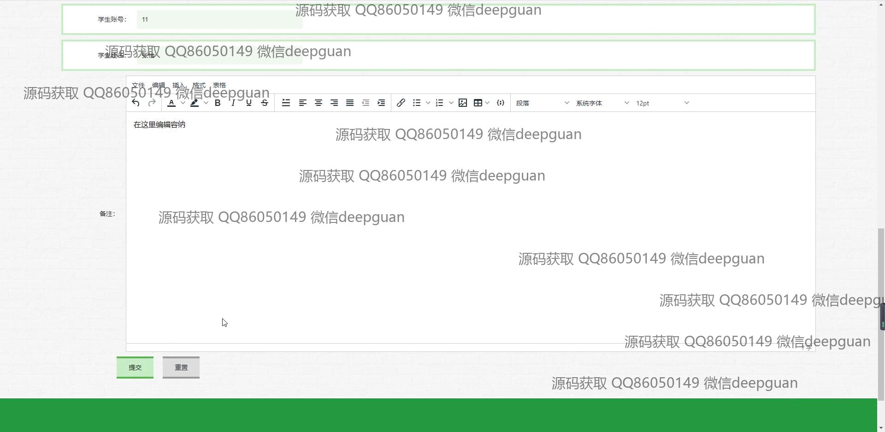

<h1 align="center">基于Java的高校成绩报送系统的设计与实现</h1>

## 简介
高校成绩报送系统：提供课程管理、成绩记录、教师和学生信息管理、公告编辑、数据查询和统计功能，优化高校信息交流与处理效率。    --计算机毕业设计源码；毕设源码；java毕业设计源码

## 联系方式

<h3 align="center">获取完整代码与数据库文件 + 微信：deepguan QQ: 86050149 QQ群: 783742310</h3>

<h3 align="center">可帮忙远程部署 包运行成功！提供远程部署、修改代码、设计文档指导、代码讲解等服务！</h3>

## 功能介绍（完整见运行截图）
管理员：基本功能包括登录、注册、退出系统；提供学生、教师、课程、成绩、公告等信息的管理功能；支持批量添加、编辑、删除数据，并能生成和导出成绩报表；通过系统管理模块配置用户权限和操作日志。

教师：可以通过教师管理模块查看和修改个人信息；在课程信息管理中新增或编辑课程，上传课程资料；通过成绩管理模块录入、修改和导出学生成绩；使用公告管理功能发布课程相关通知。

学生：能够注册账户并登录个人中心查看课程和成绩信息；通过选课模块选择课程并查看相关课程的详细资料；查询个人成绩及课程公告；在个人中心更新个人信息并管理收藏的课程。

访客：可通过系统首页浏览课程信息和公告内容；在注册页面创建账户；查看系统推荐的相关课程或书籍资源，了解高校成绩管理系统的基本功能和操作方式。

## 运行截图

本代码来源于网络,仅供学习参考使用!

